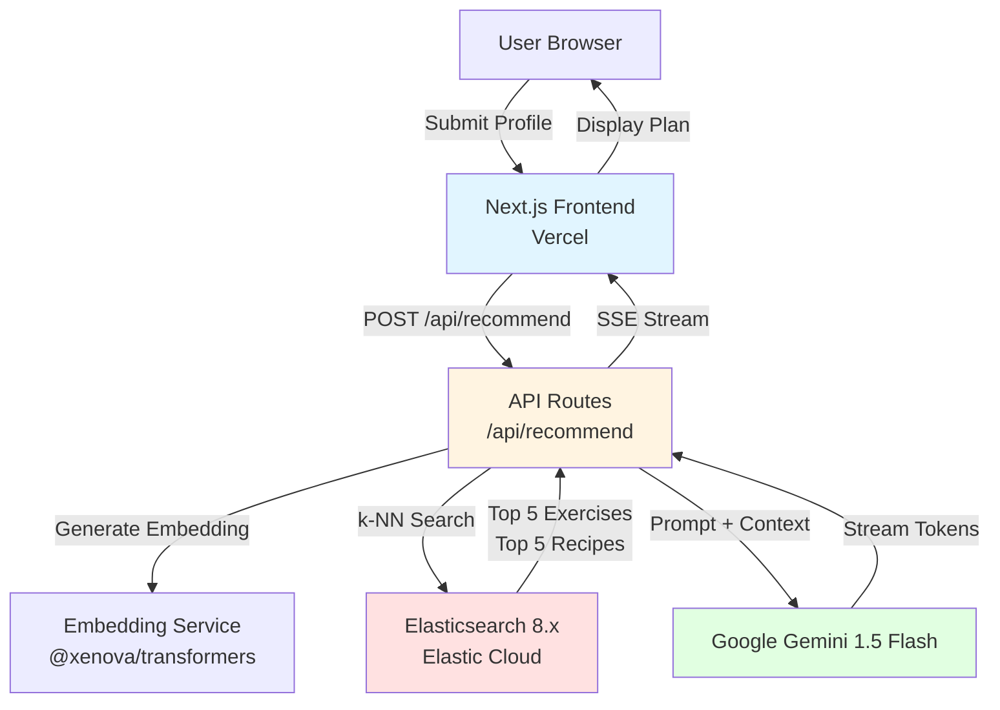

# Design Document: RAG Health & Fitness Engine

## Overview

The RAG Health & Fitness Engine is a full-stack web application that implements a Retrieval-Augmented Generation (RAG) pipeline for personalized fitness and nutrition recommendations. The system architecture follows a three-tier pattern:

1. **Frontend Layer**: Next.js 14 App Router application providing user interface and form validation
2. **API Layer**: Next.js API routes orchestrating the RAG pipeline (embedding → retrieval → generation)
3. **Data Layer**: Elasticsearch 8.x vector store containing pre-indexed exercise and recipe embeddings

The core workflow follows this sequence:
- User submits demographic profile (age, sex, weight, height, goal)
- System generates query embedding using all-MiniLM-L6-v2 model
- System performs k-NN vector search against exercise and recipe indices
- System constructs prompt with user profile and retrieved context
- Google Gemini 1.5 Flash generates personalized weekly plan
- System streams response tokens to frontend via Server-Sent Events

This design prioritizes simplicity and rapid deployment using free-tier services (Vercel, Elastic Cloud 14-day trial) while supporting 20 concurrent users for a 2-week demonstration period.

## Architecture

### System Components



### Data Flow

**Request Path:**
1. Frontend validates user input (age, sex, weight, height, goal)
2. Frontend sends POST request to `/api/recommend` with User_Profile
3. API route extracts goal text and generates 384-dimensional Query_Embedding
4. API route executes parallel k-NN searches:
   - `exercises_v1` index → top 5 Exercise_Hit documents
   - `recipes_v1` index → top 5 Recipe_Hit documents
5. API route constructs prompt template with User_Profile and retrieved context
6. API route streams LLM response using Server-Sent Events

**Response Path:**
1. LLM generates tokens incrementally
2. API route forwards tokens via SSE
3. Frontend appends tokens to display buffer
4. Frontend renders complete Weekly_Plan when stream ends

### Deployment Architecture

- **Frontend**: Vercel free tier (automatic deployment from Git)
- **API Routes**: Vercel serverless functions (Node.js 18+ runtime)
- **Vector Store**: Elastic Cloud 14-day trial (single-node cluster)
- **Embedding Model**: Runs in-process via @xenova/transformers (no external API)
- **LLM**: Google Gemini API (external service)

### Technology Stack

| Layer | Technology | Justification |
|-------|-----------|---------------|
| Frontend | Next.js 14 App Router | Server-side rendering, API routes, Vercel integration |
| UI Components | React 18 | Component-based architecture, streaming support |
| API Runtime | Node.js 18+ | Serverless function compatibility |
| Embedding | @xenova/transformers | In-process execution, no API costs |
| Vector Store | Elasticsearch 8.x | Native k-NN search, cosine similarity |
| LLM | Google Gemini 1.5 Flash | Fast streaming, free tier available |
| Ingestion | Python 3.10+ | Rich ecosystem for web scraping and data processing |
| Type Safety | TypeScript 5.x | Compile-time type checking |

## Components and Interfaces

### Frontend Components

#### ProfileForm Component
**Responsibility**: Capture and validate user demographic data

**Props**:
```typescript
interface ProfileFormProps {
  onSubmit: (profile: UserProfile) => void;
  isLoading: boolean;
}
```

**State**:
- Form field values (age, sex, weight, height, goal)
- Validation errors per field
- Submission state

**Validation Rules**:
- Age: positive integer
- Sex: non-empty string
- Weight: positive number (kg)
- Height: positive number (cm)
- Goal: non-empty string (min 10 characters)

#### PlanDisplay Component
**Responsibility**: Render streaming LLM response

**Props**:
```typescript
interface PlanDisplayProps {
  content: string;
  isStreaming: boolean;
  error: string | null;
}
```

**Behavior**:
- Displays loading indicator during streaming
- Appends tokens incrementally
- Shows error messages on failure
- Supports markdown rendering for formatted plans

### API Routes

#### POST /api/recommend

**Request Body**:
```typescript
interface RecommendRequest {
  age: number;
  sex: string;
  weight: number;  // kg
  height: number;  // cm
  goal: string;
}
```

**Response**: Server-Sent Events stream

**Event Format**:
```typescript
// Success events
data: {"type": "token", "content": "string"}
data: {"type": "done"}

// Error events
data: {"type": "error", "message": "string"}
```

**Error Status Codes**:
- 400: Invalid request body
- 401: Invalid API keys
- 500: Embedding generation failure
- 503: Elasticsearch or LLM unavailable

### Library Modules

#### lib/embedding.ts

**Purpose**: Generate query embeddings using all-MiniLM-L6-v2

**Interface**:
```typescript
export async function generateEmbedding(text: string): Promise<number[]>;
```

**Implementation Details**:
- Uses @xenova/transformers pipeline
- Returns 384-dimensional dense vector
- Caches model in memory after first load
- Throws error on model initialization failure

#### lib/elasticsearch.ts

**Purpose**: Execute k-NN vector searches

**Interface**:
```typescript
export interface SearchResult {
  exercises: ExerciseHit[];
  recipes: RecipeHit[];
}

export async function searchVectors(
  embedding: number[],
  k: number = 5
): Promise<SearchResult>;
```

**Implementation Details**:
- Creates Elasticsearch client with API key from env
- Executes parallel searches using Promise.all
- Uses cosine similarity for distance metric
- Returns top k results per index

#### lib/llm.ts

**Purpose**: Stream LLM responses using Google Gemini

**Interface**:
```typescript
export async function* streamCompletion(
  prompt: string
): AsyncGenerator<string, void, unknown>;
```

**Implementation Details**:
- Uses Google Generative AI SDK
- Configures Gemini 1.5 Flash model
- Yields tokens as they arrive
- Handles API errors and retries

#### lib/prompt.ts

**Purpose**: Construct RAG prompts with retrieved context

**Interface**:
```typescript
export function buildPrompt(
  profile: UserProfile,
  exercises: ExerciseHit[],
  recipes: RecipeHit[]
): string;
```

**Prompt Template**:
```
You are a fitness and nutrition expert. Create a personalized weekly plan based on the following information:

USER PROFILE:
- Age: {age}
- Sex: {sex}
- Weight: {weight} kg
- Height: {height} cm
- Goal: {goal}

AVAILABLE EXERCISES:
{exercises with name, category, muscles, equipment, difficulty, kcal_per_min}

AVAILABLE RECIPES:
{recipes with name, calories, protein, carbs, fat, ingredients, tags}

Generate a 7-day plan that:
1. Includes specific exercises from the provided list
2. Includes specific recipes from the provided list
3. Aligns with the user's goal
4. Considers the user's demographics
5. Provides daily structure (morning, afternoon, evening)

IMPORTANT: Only reference exercises and recipes from the lists above. Do not invent new ones.
```

### Ingestion Scripts

#### scripts/ingest_exercises.py

**Purpose**: Fetch, embed, and index exercise data

**Data Source**: Wger Workout Manager API

**Process**:
1. Fetch exercise data via API pagination
2. Normalize fields (name, category, muscles, equipment, difficulty)
3. Estimate kcal_per_min based on exercise type
4. Generate embeddings using sentence-transformers
5. Bulk index to exercises_v1 with 384-dim dense_vector

**Dependencies**:
- requests (API calls)
- sentence-transformers (embedding generation)
- elasticsearch (bulk indexing)

#### scripts/ingest_recipes.py

**Purpose**: Scrape, embed, and index recipe data

**Data Source**: Allrecipes.com (Schema.org JSON-LD)

**Process**:
1. Crawl recipe pages with rate limiting
2. Extract JSON-LD structured data
3. Normalize nutrition fields (calories, protein_g, carbs_g, fat_g)
4. Extract ingredients and tags
5. Generate embeddings using sentence-transformers
6. Bulk index to recipes_v1 with 384-dim dense_vector

**Dependencies**:
- beautifulsoup4 (HTML parsing)
- requests (HTTP requests)
- sentence-transformers (embedding generation)
- elasticsearch (bulk indexing)

## Data Models

### TypeScript Interfaces

```typescript
// User input
export interface UserProfile {
  age: number;
  sex: string;
  weight: number;  // kg
  height: number;  // cm
  goal: string;
}

// Elasticsearch document types
export interface ExerciseHit {
  name: string;
  category: string;
  muscles: string[];
  equipment: string;
  difficulty: string;
  kcal_per_min: number;
  embedding: number[];  // 384-dim
}

export interface RecipeHit {
  name: string;
  calories: number;
  protein_g: number;
  carbs_g: number;
  fat_g: number;
  ingredients: string[];
  tags: string[];
  embedding: number[];  // 384-dim
}

// API response types
export interface StreamEvent {
  type: 'token' | 'done' | 'error';
  content?: string;
  message?: string;
}
```

### Elasticsearch Index Mappings

#### exercises_v1 Index

```json
{
  "mappings": {
    "properties": {
      "name": { "type": "text" },
      "category": { "type": "keyword" },
      "muscles": { "type": "keyword" },
      "equipment": { "type": "keyword" },
      "difficulty": { "type": "keyword" },
      "kcal_per_min": { "type": "float" },
      "embedding": {
        "type": "dense_vector",
        "dims": 384,
        "index": true,
        "similarity": "cosine"
      }
    }
  }
}
```

#### recipes_v1 Index

```json
{
  "mappings": {
    "properties": {
      "name": { "type": "text" },
      "calories": { "type": "integer" },
      "protein_g": { "type": "float" },
      "carbs_g": { "type": "float" },
      "fat_g": { "type": "float" },
      "ingredients": { "type": "text" },
      "tags": { "type": "keyword" },
      "embedding": {
        "type": "dense_vector",
        "dims": 384,
        "index": true,
        "similarity": "cosine"
      }
    }
  }
}
```

### Environment Variables

```typescript
// Required environment variables
interface EnvironmentConfig {
  ELASTICSEARCH_URL: string;      // Elastic Cloud endpoint
  ELASTICSEARCH_API_KEY: string;  // API key for authentication
  GOOGLE_GEMINI_API_KEY: string;  // Gemini API key
}
```

**Security Requirements**:
- Store in `.env.local` (gitignored)
- Configure in Vercel project settings
- Never expose in client-side code
- Validate presence at runtime


## Correctness Properties

**Property-based testing is not applicable to this feature.**

This application primarily orchestrates external services (Elasticsearch, Google Gemini API) and handles I/O operations rather than implementing pure algorithmic transformations. The system's correctness depends on:

1. **External Service Integration**: The core functionality involves API calls to Elasticsearch and Google Gemini, which are not pure functions suitable for property-based testing
2. **UI Rendering and Validation**: Form validation and display components are better tested with example-based unit tests and snapshot tests
3. **Data Ingestion Side Effects**: Web scraping and bulk indexing operations involve side effects and external dependencies
4. **Streaming I/O**: Server-Sent Events streaming is an I/O operation, not a pure transformation

**Alternative Testing Approach**: Instead of property-based tests, this design employs:
- **Unit tests** for validation logic and utility functions (example-based)
- **Integration tests** for API interactions with mocked/real external services
- **Component tests** for React UI behavior
- **End-to-end tests** for complete user workflows
- **Manual testing** for LLM output quality assessment

This multi-layered testing strategy provides comprehensive coverage appropriate for an integration-heavy web application.

## Error Handling

### Error Categories and Strategies

#### 1. Client-Side Validation Errors

**Scenario**: User submits invalid form data

**Handling**:
- Validate all fields before submission
- Display inline error messages per field
- Prevent API call until validation passes
- Provide clear guidance on expected formats

**Error Messages**:
- Age: "Age must be a positive number"
- Sex: "Sex is required"
- Weight: "Weight must be a positive number in kg"
- Height: "Height must be a positive number in cm"
- Goal: "Goal must be at least 10 characters"

#### 2. Embedding Generation Errors

**Scenario**: @xenova/transformers model fails to load or generate embedding

**Handling**:
- Catch exceptions in `lib/embedding.ts`
- Log error details server-side
- Return 500 status code with generic message
- Retry logic: None (model loading is deterministic)

**User-Facing Message**: "Unable to process your request. Please try again."

**Logging**:
```typescript
console.error('Embedding generation failed:', {
  error: error.message,
  stack: error.stack,
  timestamp: new Date().toISOString()
});
```

#### 3. Elasticsearch Connection Errors

**Scenario**: Vector store is unreachable or returns errors

**Handling**:
- Catch connection errors in `lib/elasticsearch.ts`
- Distinguish between network errors and query errors
- Return 503 status code for service unavailability
- Retry logic: Single retry with 1-second delay

**User-Facing Message**: "Search service is temporarily unavailable. Please try again in a moment."

**Error Detection**:
- Connection timeout (5 seconds)
- Authentication failures (401)
- Index not found errors
- Query execution errors

#### 4. LLM API Errors

**Scenario**: Google Gemini API is unavailable or rate-limited

**Handling**:
- Catch API errors in `lib/llm.ts`
- Distinguish between rate limits, auth errors, and service errors
- Return 503 status code for service unavailability
- Retry logic: Exponential backoff (1s, 2s, 4s) for rate limits

**User-Facing Messages**:
- Rate limit: "Service is busy. Please try again in a few moments."
- Auth error: "Service configuration error. Please contact support."
- General error: "Unable to generate recommendations. Please try again."

**Error Detection**:
- HTTP 429 (rate limit)
- HTTP 401/403 (authentication)
- HTTP 500/503 (service errors)
- Network timeouts (30 seconds)

#### 5. Streaming Interruption Errors

**Scenario**: SSE connection drops during LLM streaming

**Handling**:
- Detect connection close events in API route
- Clean up resources (abort LLM stream)
- Frontend detects stream interruption
- Display partial results with error indicator

**User-Facing Message**: "Connection interrupted. Partial results shown above."

**Implementation**:
```typescript
// API route
req.on('close', () => {
  abortController.abort();
  console.log('Client disconnected during streaming');
});

// Frontend
eventSource.onerror = (error) => {
  setError('Connection interrupted');
  setIsStreaming(false);
};
```

#### 6. Data Ingestion Errors

**Scenario**: Ingestion script encounters malformed data or API failures

**Handling**:
- Log error details with document identifier
- Continue processing remaining documents
- Report summary statistics at completion
- Do not halt entire ingestion on single failure

**Error Logging**:
```python
try:
    process_document(doc)
except Exception as e:
    logger.error(f"Failed to process document {doc['id']}: {e}")
    failed_count += 1
    continue
```

**Summary Report**:
```
Ingestion Complete:
- Total processed: 5000
- Successful: 4987
- Failed: 13
- Duration: 28m 34s
```

#### 7. Environment Configuration Errors

**Scenario**: Required environment variables are missing or invalid

**Handling**:
- Validate environment variables at application startup
- Fail fast with clear error messages
- Do not start server if configuration is invalid
- Log missing variables

**Validation**:
```typescript
function validateEnvironment() {
  const required = [
    'ELASTICSEARCH_URL',
    'ELASTICSEARCH_API_KEY',
    'GOOGLE_GEMINI_API_KEY'
  ];
  
  const missing = required.filter(key => !process.env[key]);
  
  if (missing.length > 0) {
    throw new Error(`Missing required environment variables: ${missing.join(', ')}`);
  }
}
```

### Error Response Format

All API errors follow consistent JSON structure:

```typescript
interface ErrorResponse {
  error: {
    message: string;      // User-facing message
    code: string;         // Error code for client handling
    timestamp: string;    // ISO 8601 timestamp
  }
}
```

**Example**:
```json
{
  "error": {
    "message": "Search service is temporarily unavailable",
    "code": "ELASTICSEARCH_UNAVAILABLE",
    "timestamp": "2024-01-15T10:30:00.000Z"
  }
}
```

### Logging Strategy

**Server-Side Logging**:
- All errors logged with context (user profile, query, stack trace)
- No sensitive data in logs (API keys, personal health data)
- Structured logging format for parsing
- Log levels: ERROR (failures), WARN (retries), INFO (requests)

**Client-Side Logging**:
- Console errors for debugging (development only)
- No logging in production (privacy)
- Error boundaries catch React errors

### Graceful Degradation

**Partial Results**:
- If exercise search succeeds but recipe search fails, generate plan with exercises only
- If LLM stream interrupts, display partial plan with warning
- If embedding fails, fall back to keyword search (future enhancement)

**Service Availability**:
- Display service status on homepage
- Show estimated wait time during high load
- Provide alternative contact method when service is down

## Testing Strategy

### Testing Approach

This application requires a **multi-layered testing strategy** combining unit tests, integration tests, and end-to-end tests. Property-based testing is **not applicable** because the system primarily orchestrates external services (Elasticsearch, Google Gemini API) and handles I/O operations rather than implementing pure algorithmic logic.

### Test Categories

#### 1. Unit Tests

**Purpose**: Verify individual functions and components in isolation

**Scope**:
- Form validation logic
- Prompt template construction
- Error message formatting
- TypeScript type guards
- Utility functions

**Framework**: Jest + React Testing Library

**Example Tests**:

```typescript
// Form validation
describe('ProfileForm validation', () => {
  it('should reject negative age', () => {
    expect(validateAge(-5)).toBe(false);
  });
  
  it('should reject empty goal', () => {
    expect(validateGoal('')).toBe(false);
  });
  
  it('should accept valid profile', () => {
    const profile = {
      age: 30,
      sex: 'male',
      weight: 75,
      height: 180,
      goal: 'Build muscle and lose fat'
    };
    expect(validateProfile(profile)).toBe(true);
  });
});

// Prompt construction
describe('buildPrompt', () => {
  it('should include user profile in prompt', () => {
    const prompt = buildPrompt(mockProfile, mockExercises, mockRecipes);
    expect(prompt).toContain('Age: 30');
    expect(prompt).toContain('Weight: 75 kg');
  });
  
  it('should include all exercises', () => {
    const prompt = buildPrompt(mockProfile, mockExercises, mockRecipes);
    mockExercises.forEach(ex => {
      expect(prompt).toContain(ex.name);
    });
  });
  
  it('should format nutrition data correctly', () => {
    const prompt = buildPrompt(mockProfile, mockExercises, mockRecipes);
    expect(prompt).toMatch(/\d+ calories/);
    expect(prompt).toMatch(/\d+g protein/);
  });
});
```

**Coverage Target**: 80% for utility functions and validation logic

#### 2. Integration Tests

**Purpose**: Verify interactions between components and external services

**Scope**:
- Elasticsearch k-NN search queries
- Embedding generation pipeline
- LLM API integration
- API route handlers
- SSE streaming

**Framework**: Jest + Supertest + Test Containers (optional)

**Test Strategy**:
- Use mock Elasticsearch responses for most tests
- Use real Elasticsearch instance for critical path tests (CI environment)
- Mock LLM responses to avoid API costs
- Test error handling with simulated failures

**Example Tests**:

```typescript
// Elasticsearch integration
describe('searchVectors', () => {
  it('should return top 5 exercises and recipes', async () => {
    const embedding = new Array(384).fill(0.1);
    const results = await searchVectors(embedding, 5);
    
    expect(results.exercises).toHaveLength(5);
    expect(results.recipes).toHaveLength(5);
    expect(results.exercises[0]).toHaveProperty('name');
    expect(results.exercises[0]).toHaveProperty('kcal_per_min');
  });
  
  it('should handle Elasticsearch connection errors', async () => {
    // Simulate connection failure
    mockElasticsearchClient.search.mockRejectedValue(
      new Error('Connection refused')
    );
    
    await expect(searchVectors(embedding, 5))
      .rejects.toThrow('Search service unavailable');
  });
});

// API route integration
describe('POST /api/recommend', () => {
  it('should return streaming response for valid profile', async () => {
    const response = await request(app)
      .post('/api/recommend')
      .send(validProfile)
      .expect(200)
      .expect('Content-Type', /text\/event-stream/);
    
    // Verify SSE format
    expect(response.text).toContain('data: ');
  });
  
  it('should return 400 for invalid profile', async () => {
    const response = await request(app)
      .post('/api/recommend')
      .send({ age: -5 })
      .expect(400);
    
    expect(response.body.error.code).toBe('INVALID_INPUT');
  });
  
  it('should return 503 when Elasticsearch is down', async () => {
    mockElasticsearchClient.search.mockRejectedValue(
      new Error('Service unavailable')
    );
    
    const response = await request(app)
      .post('/api/recommend')
      .send(validProfile)
      .expect(503);
    
    expect(response.body.error.message).toContain('Search service');
  });
});
```

**Coverage Target**: 70% for integration paths

#### 3. Component Tests

**Purpose**: Verify React component behavior and rendering

**Scope**:
- ProfileForm component
- PlanDisplay component
- Error message components
- Loading indicators

**Framework**: Jest + React Testing Library

**Example Tests**:

```typescript
describe('ProfileForm', () => {
  it('should render all input fields', () => {
    render(<ProfileForm onSubmit={jest.fn()} isLoading={false} />);
    
    expect(screen.getByLabelText(/age/i)).toBeInTheDocument();
    expect(screen.getByLabelText(/sex/i)).toBeInTheDocument();
    expect(screen.getByLabelText(/weight/i)).toBeInTheDocument();
    expect(screen.getByLabelText(/height/i)).toBeInTheDocument();
    expect(screen.getByLabelText(/goal/i)).toBeInTheDocument();
  });
  
  it('should show validation errors on invalid submit', async () => {
    render(<ProfileForm onSubmit={jest.fn()} isLoading={false} />);
    
    const submitButton = screen.getByRole('button', { name: /submit/i });
    fireEvent.click(submitButton);
    
    await waitFor(() => {
      expect(screen.getByText(/age must be a positive number/i))
        .toBeInTheDocument();
    });
  });
  
  it('should call onSubmit with valid data', async () => {
    const onSubmit = jest.fn();
    render(<ProfileForm onSubmit={onSubmit} isLoading={false} />);
    
    fireEvent.change(screen.getByLabelText(/age/i), { target: { value: '30' } });
    fireEvent.change(screen.getByLabelText(/sex/i), { target: { value: 'male' } });
    fireEvent.change(screen.getByLabelText(/weight/i), { target: { value: '75' } });
    fireEvent.change(screen.getByLabelText(/height/i), { target: { value: '180' } });
    fireEvent.change(screen.getByLabelText(/goal/i), { 
      target: { value: 'Build muscle' } 
    });
    
    fireEvent.click(screen.getByRole('button', { name: /submit/i }));
    
    await waitFor(() => {
      expect(onSubmit).toHaveBeenCalledWith({
        age: 30,
        sex: 'male',
        weight: 75,
        height: 180,
        goal: 'Build muscle'
      });
    });
  });
});

describe('PlanDisplay', () => {
  it('should show loading indicator when streaming', () => {
    render(<PlanDisplay content="" isStreaming={true} error={null} />);
    expect(screen.getByText(/generating/i)).toBeInTheDocument();
  });
  
  it('should display streamed content', () => {
    const content = 'Day 1: Push-ups and protein shake';
    render(<PlanDisplay content={content} isStreaming={false} error={null} />);
    expect(screen.getByText(content)).toBeInTheDocument();
  });
  
  it('should display error message', () => {
    const error = 'Service unavailable';
    render(<PlanDisplay content="" isStreaming={false} error={error} />);
    expect(screen.getByText(error)).toBeInTheDocument();
  });
});
```

**Coverage Target**: 75% for component logic

#### 4. End-to-End Tests

**Purpose**: Verify complete user workflows in production-like environment

**Scope**:
- Full RAG pipeline (form submission → streaming response)
- Error scenarios (service unavailable, network errors)
- Mobile and desktop viewports
- Browser compatibility

**Framework**: Playwright

**Test Strategy**:
- Run against staging environment with real services
- Use test data that doesn't pollute production indices
- Mock external services for reliability
- Test critical path only (not exhaustive)

**Example Tests**:

```typescript
test('complete recommendation flow', async ({ page }) => {
  await page.goto('/');
  
  // Fill form
  await page.fill('[name="age"]', '30');
  await page.fill('[name="sex"]', 'male');
  await page.fill('[name="weight"]', '75');
  await page.fill('[name="height"]', '180');
  await page.fill('[name="goal"]', 'Build muscle and improve endurance');
  
  // Submit
  await page.click('button[type="submit"]');
  
  // Wait for streaming to start
  await page.waitForSelector('[data-testid="plan-display"]');
  
  // Verify content appears
  await expect(page.locator('[data-testid="plan-display"]'))
    .toContainText('Day 1', { timeout: 10000 });
  
  // Wait for completion
  await page.waitForSelector('[data-testid="streaming-complete"]', {
    timeout: 30000
  });
  
  // Verify plan structure
  const planText = await page.textContent('[data-testid="plan-display"]');
  expect(planText).toContain('Day 1');
  expect(planText).toContain('Day 7');
});

test('handles service unavailable error', async ({ page }) => {
  // Simulate Elasticsearch down (via test configuration)
  await page.route('**/api/recommend', route => {
    route.fulfill({
      status: 503,
      body: JSON.stringify({
        error: {
          message: 'Search service is temporarily unavailable',
          code: 'ELASTICSEARCH_UNAVAILABLE'
        }
      })
    });
  });
  
  await page.goto('/');
  await fillValidForm(page);
  await page.click('button[type="submit"]');
  
  await expect(page.locator('[role="alert"]'))
    .toContainText('Search service is temporarily unavailable');
});
```

**Coverage Target**: Critical user paths only (3-5 scenarios)

#### 5. Data Ingestion Tests

**Purpose**: Verify ingestion scripts process data correctly

**Scope**:
- Exercise API parsing
- Recipe scraping and extraction
- Embedding generation
- Bulk indexing
- Error handling and logging

**Framework**: pytest

**Test Strategy**:
- Use fixture data (saved API responses, HTML pages)
- Mock Elasticsearch bulk operations
- Verify data normalization logic
- Test error recovery

**Example Tests**:

```python
def test_exercise_normalization():
    """Test that raw API data is normalized correctly"""
    raw_data = load_fixture('wger_exercise_response.json')
    normalized = normalize_exercise(raw_data['results'][0])
    
    assert 'name' in normalized
    assert 'category' in normalized
    assert 'muscles' in normalized
    assert isinstance(normalized['muscles'], list)
    assert 'kcal_per_min' in normalized
    assert normalized['kcal_per_min'] > 0

def test_recipe_extraction():
    """Test Schema.org JSON-LD extraction"""
    html = load_fixture('allrecipes_page.html')
    recipe = extract_recipe_data(html)
    
    assert recipe['name']
    assert recipe['calories'] > 0
    assert 'protein_g' in recipe
    assert len(recipe['ingredients']) > 0

def test_bulk_indexing_with_errors(mock_es_client):
    """Test that ingestion continues after individual failures"""
    documents = [
        {'id': 1, 'name': 'Valid'},
        {'id': 2, 'name': None},  # Will fail validation
        {'id': 3, 'name': 'Valid'}
    ]
    
    result = bulk_index_documents(mock_es_client, documents)
    
    assert result['successful'] == 2
    assert result['failed'] == 1
    assert 2 in result['failed_ids']
```

**Coverage Target**: 70% for ingestion logic

### Test Execution Strategy

**Local Development**:
```bash
# Unit and component tests
npm test

# Integration tests (requires local Elasticsearch)
npm run test:integration

# E2E tests (requires running app)
npm run test:e2e
```

**CI Pipeline**:
1. Run unit tests on every commit
2. Run integration tests on pull requests (with Docker Elasticsearch)
3. Run E2E tests on staging deployment
4. Block merge if critical tests fail

**Test Data Management**:
- Store fixture data in `tests/fixtures/`
- Use factory functions for test objects
- Reset test indices between integration tests
- Use separate Elasticsearch indices for testing

### Performance Testing

**Load Testing**:
- Simulate 20 concurrent users using k6 or Artillery
- Target: 95th percentile response time < 10 seconds
- Monitor Elasticsearch query performance
- Monitor LLM API rate limits

**Stress Testing**:
- Test behavior under Elastic Cloud trial limits
- Test behavior when LLM rate limits are hit
- Verify graceful degradation

### Manual Testing Checklist

Before deployment:
- [ ] Test on Chrome, Firefox, Safari
- [ ] Test on mobile viewport (iOS Safari, Chrome Android)
- [ ] Verify all error messages are user-friendly
- [ ] Test with various goal descriptions (short, long, special characters)
- [ ] Verify no API keys exposed in browser DevTools
- [ ] Test streaming interruption (close browser during generation)
- [ ] Verify Elasticsearch trial expiration handling
- [ ] Test with slow network connection

### Testing Limitations

**What We Cannot Test**:
- Actual LLM response quality (requires human evaluation)
- Embedding model accuracy (requires benchmark datasets)
- Long-term service availability (14-day trial constraint)
- Production load beyond 20 concurrent users

**Mitigation**:
- Manual review of sample LLM outputs
- Use established embedding model (all-MiniLM-L6-v2)
- Monitor service health during trial period
- Document scaling requirements for production

